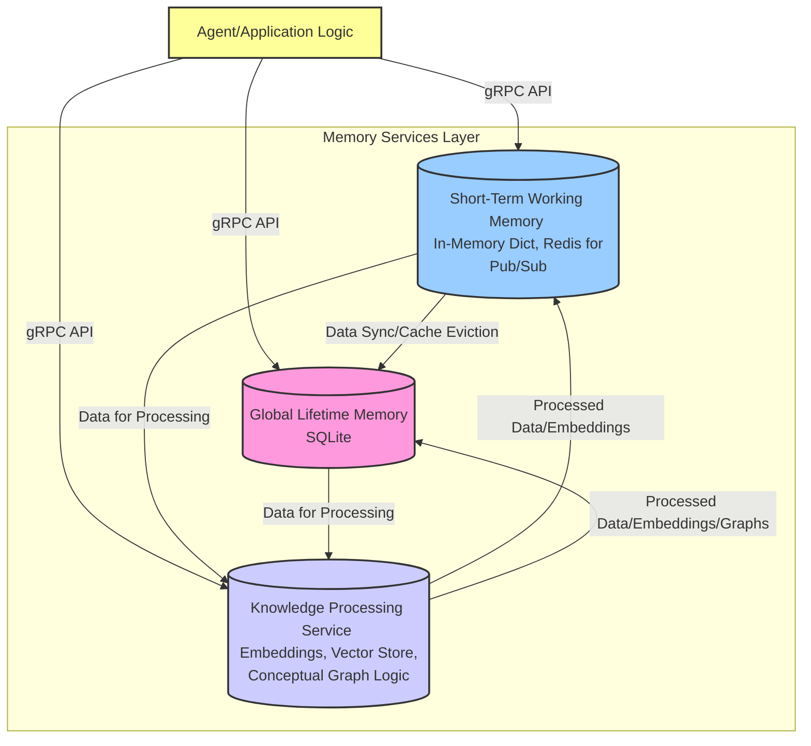

# DCSM Memory System Architecture

## 1. Introduction

The Distributed Cognitive State Management (DCSM) system provides sophisticated memory capabilities crucial for autonomous agents. This document details the architecture and interplay of its core Python-based memory components: Global Lifetime Memory (GLM), Short-Term Working Memory (SWM), and Knowledge Processing Service (KPS). Together, they enable agents to store, retrieve, process, and utilize information effectively throughout their operational lifecycle.

### 1.1 ASCII Art Overview

Below is a simplified ASCII representation of the memory architecture, illustrating the main components and their primary interactions with an agent:

```text
+-----------------+         +---------------------------+
|      AGENT      |<------->|   Short-Term Working Mem. |
| (App Logic)     |         | (SWM)                     |
+-----------------+         | - In-Memory Key/Value     |
        |                   | - Redis Pub/Sub           |
        |                   +-------------+-------------+
        |                                 |  ^ (Cache, Temp Data)
        | (gRPC API Calls)                |  |
        |                                 V  |
        |                   +-------------+-------------+
        +------------------>|   Global Lifetime Memory  |
        |                   | (GLM)                     |
        |                   | - SQLite (Persistent)     |
        |                   | - KEM URI indexed         |
        |                   +-------------+-------------+
        |                                 |  ^ (Store/Retrieve)
        |                                 |  |
        |                                 V  |
        |                   +-------------+-------------+
        +------------------>| Knowledge Processing Svc. |
                            | (KPS)                     |
                            | - Embeddings (SentenceTrans)
                            | - Vector Store (ChromaDB) |
                            +---------------------------+
```

The memory system is designed to support:
-   **Persistence:** Long-term storage of critical information, experiences, and learned knowledge.
-   **Contextual Recall:** Efficient retrieval of relevant information based on current task or query.
-   **Working Memory:** Temporary storage for in-progress computations, session-specific data, and inter-agent communication.
-   **Semantic Understanding:** Processing and structuring information to derive deeper meaning and relationships.
-   **Scalability:** Handling growing volumes of data and concurrent access demands.

## 2. Core Memory Components

The DCSM memory system is composed of three primary services, each with a distinct role:



### 2.1. Global Lifetime Memory (GLM)

**Purpose:**
GLM serves as the long-term, persistent memory store for the DCSM system. It is designed to hold information that needs to be retained across agent sessions, system restarts, or even different agent instantiations if the data is shared. This includes factual knowledge, learned experiences, user preferences, historical interactions, and any data deemed valuable for future reference.

**Key Characteristics:**
-   **Persistence:** Data stored in GLM is durable and survives system shutdowns.
-   **Structured Storage:** GLM utilizes SQLite, a relational database, providing structured storage with tables, schemas, and SQL querying capabilities.
-   **Data Types:** Can store various data types including text, numbers, serialized objects (e.g., JSON, Pickle), and potentially references to larger binary data stored elsewhere.
-   **Scalability:** While SQLite is file-based, its performance is suitable for many agent applications. For extremely large-scale systems, a more distributed database might be considered, but the current implementation focuses on robust single-node persistence.
-   **Transactional Integrity:** SQLite provides ACID properties, ensuring data consistency.

**Core Functionalities (via gRPC API - defined in `glm_service.proto`):**
-   `StoreMemory(KEMUri, content, metadata_json)`: Stores a piece of memory (content, typically string or bytes) associated with a KEM URI and JSON string metadata. The KEM URI acts as a primary key.
-   `RetrieveMemory(KEMUri)`: Retrieves memory content and metadata based on its KEM URI. Returns content and metadata_json.
-   `QueryMemories(SQLQuery)`: Allows complex querying using SQL against the 'memories' table. This provides powerful and flexible data retrieval but requires careful construction of queries to prevent SQL injection if user inputs are involved (though typically queries would be system-generated).
-   `DeleteMemory(KEMUri)`: Removes a specific memory item by its KEM URI.
-   `UpdateMemory(KEMUri, content, metadata_json)`: Modifies an existing memory item.
-   `ListMemories(limit, offset, optional_filter_kem_uri_prefix)`: Retrieves a list of memory items, with pagination and an optional prefix filter for KEM URIs.

**Internal Implementation (Primarily `glm/glm_node.py` and `glm/database.py`):**
-   **`GLMNode(Service)` class in `glm_node.py`**: Implements the gRPC service handlers defined in `glm_service.proto`. It instantiates and uses the `Database` class.
-   **`Database` class in `glm/database.py`**:
    -   Manages the SQLite connection (`self.conn`).
    -   Initializes the database by calling `create_table()` on instantiation.
    -   `create_table()`: Defines the `memories` table schema:
        -   `id` (INTEGER PRIMARY KEY AUTOINCREMENT)
        -   `kem_uri` (TEXT UNIQUE NOT NULL)
        -   `content` (BLOB) - Can store text or binary data.
        -   `metadata_json` (TEXT) - Stores metadata as a JSON string.
        -   `created_at` (TIMESTAMP DEFAULT CURRENT_TIMESTAMP)
        -   `updated_at` (TIMESTAMP DEFAULT CURRENT_TIMESTAMP)
    -   Provides methods corresponding to each gRPC call (e.g., `add_memory`, `get_memory`, `update_memory`, `delete_memory`, `list_memories`, `query_memories_dynamic`).
    -   Uses parameterized queries (`?`) to prevent SQL injection.
    -   Metadata is stored as a JSON string, requiring serialization/deserialization in the application logic or service layer. Querying specific fields within this JSON is supported using SQLite's JSON functions (e.g., `json_extract`), with performance being optimal when appropriate JSON indexes are used and SQLite version is >= 3.38.0.
    -   **SQLite PRAGMA Settings:** To enhance performance and concurrency, GLM configures SQLite with specific PRAGMA settings upon connection, including WAL (Write-Ahead Logging) mode, appropriate synchronous levels, busy timeout handling, and a configurable per-connection cache size (`SQLITE_CACHE_SIZE_KB`).
-   **KEM URI Handling:** KEM URIs are the designated unique identifiers for memories in GLM. Their structure and generation are external to GLM but crucial for its addressing scheme.

**Use Cases:**
-   Storing factual knowledge extracted from documents.
-   Remembering past user interactions and preferences.
-   Archiving results of completed tasks.
-   Building a persistent knowledge base over time.

### 2.2. Short-Term Working Memory (SWM)

**Purpose:**
SWM provides a fast, transient memory space for agents. It's used for storing temporary data relevant to current tasks, session-specific information, intermediate results of computations, and facilitating rapid communication or data sharing between different components or sub-agents working on a collaborative task.

**Key Characteristics:**
-   **Volatility/Transience:** Data in SWM is typically not expected to persist across extended periods or system restarts (though some caching mechanisms might offer limited persistence). The primary store is in-memory.
-   **High Speed:** Optimized for low-latency read/write operations.
-   **Dynamic Data:** Suitable for frequently changing information.
-   **Communication Hub:** Can act as a message bus or a shared blackboard for different parts of an agent or multiple agents.
-   **Caching Layer:** Can cache frequently accessed data from GLM or results from KPS to reduce latency.

**Core Functionalities (via gRPC API - defined in `swm_service.proto`):**
-   `StoreMemory(key, value, ttl_seconds)`: Stores a key-value pair (both strings) in the in-memory store. `ttl_seconds` (int) makes the entry expire. A TTL of 0 means no expiration.
-   `RetrieveMemory(key)`: Retrieves the value (string) for a given key from the in-memory store.
-   `DeleteMemory(key)`: Deletes a key-value pair from the in-memory store.
-   `Publish(topic, message)`: Publishes a message (string) to a given topic using Redis Pub/Sub.
-   `Subscribe(topic)`: Subscribes to a topic on Redis Pub/Sub, returning a stream of messages (strings).
-   `ListKeys(prefix)`: Lists keys in the in-memory store that match the given prefix.

**Internal Implementation (Primarily `swm/swm_node.py`, `swm/memory_store.py`, `swm/pubsub_manager.py`, and `common/utils/redis_client.py`):**
-   **`SWMNode(Service)` class in `swm_node.py`**: Implements the gRPC service handlers.
    -   Uses `MemoryStore` for key-value operations.
    -   Uses `PubSubManager` for publish/subscribe operations.
-   **`MemoryStore` class in `swm/memory_store.py`**:
    -   Manages an in-memory dictionary (`self.data`) for storing key-value pairs.
    -   Uses a separate dictionary (`self.expirations`) and a `threading.Timer` for each key with a TTL to handle expirations.
    -   Provides methods like `set_value`, `get_value`, `delete_value`, `list_keys_by_prefix`.
    -   Thread-safety is managed using `threading.Lock` (`self.lock`) for concurrent access to data and expirations.
-   **`PubSubManager` class in `swm/pubsub_manager.py`**:
    -   Manages interactions with Redis for pub/sub.
    -   Initializes a `RedisClient` from `common.utils.redis_client.py`.
    -   `publish(topic, message)`: Uses the Redis client's `publish` method.
    -   `subscribe(topic)`: Uses the Redis client's `subscribe` method, which returns a generator yielding messages from the Redis pubsub object.
-   **`RedisClient` class in `common/utils/redis_client.py`**:
    -   A wrapper around the `redis.Redis` client.
    -   Manages connection to the Redis server (host and port configured via environment variables `REDIS_HOST`, `REDIS_PORT`).
    -   Provides `publish_message` and `subscribe_to_topic` methods.

**Interaction with GLM/KPS (Consolidated):**
-   **Caching Layer:** SWM can be used by the application layer to cache frequently accessed data originally from GLM or results from KPS to reduce latency. This is managed by the agent/application, not an automatic SWM feature.
-   **Temporary Data Hub:** SWM holds transient data for ongoing tasks. This data might be sourced from user inputs, sensors, or intermediate processing steps.
-   **Input for GLM/KPS:** Data temporarily stored or processed in SWM can be subsequently committed to GLM for long-term persistence or sent to KPS for semantic processing and indexing.
-   **Communication Bus:** The Redis-backed pub/sub functionality in SWM allows different components (including agents, or even different services if they subscribe) to communicate events, signal data availability, or trigger actions in a decoupled manner. For instance, a component might publish a message when new data is available in GLM or KPS.

**Use Cases:**
-   Storing the current state of a multi-step task.
-   Holding sensory input or observations that are being actively processed.
-   Caching user profile information for the current session.
-   Facilitating real-time message passing between agent modules.
-   Scratchpad for complex calculations.

### 2.3. Knowledge Processing Service (KPS)

**Purpose:**
KPS is responsible for more advanced processing and understanding of the data stored in GLM and SWM. It aims to transform raw information into structured knowledge, enabling semantic search, inference, and the discovery of relationships within the data.

**Key Characteristics:**
-   **Semantic Understanding:** Goes beyond keyword matching to understand the meaning and context of data.
-   **Knowledge Structuring:** May involve creating knowledge graphs, generating embeddings, or classifying/tagging data.
-   **Advanced Querying:** Supports queries based on semantic similarity, relationships, or patterns rather than just exact matches.
-   **Computational Intensity:** KPS tasks (e.g., embedding generation, graph analysis) can be computationally expensive.

**Core Functionalities (via gRPC API - defined in `kps_service.proto`):**
-   `AddMemory(kem_uri, content)`: Adds content to the KPS. KPS generates an embedding for the content and stores the KEM URI, content, and embedding in its vector store.
-   `RetrieveMemory(kem_uri)`: Retrieves the original content associated with a KEM URI directly from its internal storage (if KPS stores it) or potentially from GLM. (Based on `kps_node.py`, it appears KPS stores content alongside embeddings in its vector store).
-   `QueryNearestNeighbors(kem_uri, k)`: Finds the `k` most semantically similar memories to the memory identified by `kem_uri`. It retrieves the embedding for the given `kem_uri` and queries the vector store.
-   `QueryNearestNeighborsByVector(vector, k)`: Finds the `k` most semantically similar memories to a provided query vector.
-   `RemoveMemory(kem_uri)`: Removes a memory (and its embedding) from the KPS vector store.
-   `BatchAddMemories(memories)`: Adds multiple memories in a batch. Each memory includes a KEM URI and content.
-   `BatchRemoveMemories(kem_uris)`: Removes multiple memories in a batch.
-   `GetAllMemories(page_size, page_token)`: Retrieves all memories with pagination.

**Internal Implementation (Primarily `kps/kps_node.py`, `kps/embedding_service.py`, and `common/utils/vector_store_utils.py`):**
-   **`KPSNode(Service)` class in `kps_node.py`**: Implements the gRPC service handlers.
    -   Initializes an `EmbeddingService` to generate embeddings.
    -   Initializes a `VectorStore` (e.g., `ChromaVectorStore` from `common.utils.vector_store_utils`) to store and query embeddings along with their associated KEM URIs and content.
        -   The ChromaDB collection name is configurable via the `KPS_COLLECTION_NAME` environment variable.
        -   ChromaDB can be run in-memory or in a client/server mode, configured by `CHROMA_MODE` and related environment variables (`CHROMA_HOST`, `CHROMA_PORT`).
-   **`EmbeddingService` class in `kps/embedding_service.py`**:
    -   Responsible for generating vector embeddings from text content.
    -   Uses a pre-trained model from the `sentence-transformers` library (e.g., 'all-MiniLM-L6-v2' or configurable via `EMBEDDING_MODEL_NAME` environment variable).
    -   Provides an `embed_text(text)` method.
-   **Vector Store (`ChromaVectorStore` in `common/utils/vector_store_utils.py`)**:
    -   Abstracts interactions with ChromaDB.
    -   Methods include `add_documents`, `get_document_by_id`, `query_neighbors`, `delete_documents`, `get_all_documents`.
    -   Stores embeddings, KEM URIs (as document IDs), and the original content (as document metadata). This means KPS maintains its own copy of the content it processes.
-   **Knowledge Graph Management:** The current codebase primarily focuses on vector embeddings and semantic search. While "Knowledge Processing" is in its name, explicit knowledge graph construction and querying (e.g., using SPARQL/Cypher or graph databases like Neo4j) are not directly implemented in the provided file structure. This remains a conceptual or future capability.

**Interaction with GLM/SWM:**
-   **Data Source:** KPS typically processes content that might originate from GLM (for persistent, historical data) or SWM (for new, transient data). The agent application logic would be responsible for feeding data from GLM/SWM to KPS's `AddMemory` or `BatchAddMemories` endpoints.
-   **Output Storage:**
    -   KPS stores embeddings, KEM URIs, and a copy of the content in its own vector store (ChromaDB).
    -   There isn't an explicit mechanism shown where KPS writes its processed artifacts (like embeddings) *back* to GLM as separate columns or tables. Instead, KPS serves as a specialized store for semantically searchable data.
-   **Querying:** Agents query KPS for semantic similarity. The results (KEM URIs and potentially content/scores) can then be used to:
    -   Retrieve full, original data from GLM if KPS only returns URIs/summaries (though current KPS seems to store full content).
    -   Inform subsequent operations or reasoning processes.
    -   Results from KPS could be temporarily cached in SWM by the application.

**Use Cases:**
-   Finding relevant documents or past experiences based on the meaning of a query, not just keywords.
-   Discovering hidden relationships between different pieces of information.
-   Answering complex questions that require synthesizing information from multiple sources.
-   Proactively suggesting relevant information to the agent based on context.

## 3. gRPC API and Communication

The Distributed Cognitive State Management (DCSM) system relies on gRPC as the fundamental communication layer between the agent's application logic and the various memory services (GLM, SWM, KPS). This choice provides a robust, performant, and flexible way for these components to interact.

### 3.1. Overview of gRPC Usage

All interactions with the memory services are exposed as gRPC services. This means that an agent or application wanting to store, retrieve, or process information will make gRPC calls to the appropriate service endpoint (GLM, SWM, or KPS). This standardized approach simplifies client-side development and ensures consistent communication patterns.

### 3.2. Service Definitions with Protocol Buffers

The contracts for these services—including their RPC methods, request messages, and response messages—are formally defined using Protocol Buffers (protobuf). These definitions are stored in `.proto` files, such as:

-   `glm_service.proto`: Defines the `GlobalLongTermMemory` service.
-   `swm_service.proto`: Defines the `SWMService` (Short-Term Working Memory).
-   `kps_service.proto`: Defines the `KPSService` (Knowledge Processing Service).
-   `kem.proto`: Defines the core `KEM` (Knowledge Encapsulation Module) message structure used across services.

These `.proto` files serve as the single source of truth for the API contracts. For example, a simplified service definition might look like:

```protobuf
syntax = "proto3";

package example_package;

// The service definition.
service ExampleService {
  // A simple RPC call.
  rpc GetFeature(FeatureRequest) returns (FeatureResponse);
}

// Request message
message FeatureRequest {
  string feature_id = 1;
}

// Response message
message FeatureResponse {
  string name = 1;
  string value = 2;
}
```

### 3.3. Benefits of gRPC in DCSM

The adoption of gRPC offers several key advantages for the DCSM architecture:

-   **Strongly-Typed Contracts:** Protocol Buffers enforce a clear, language-agnostic schema for messages and services. This minimizes integration errors and ensures that clients and servers agree on data structures.
-   **High Performance:** gRPC leverages HTTP/2 for multiplexed, persistent connections and uses efficient binary serialization for protobuf messages, resulting in lower latency and reduced bandwidth consumption compared to text-based protocols like JSON over HTTP/1.1.
-   **Streaming Capabilities:** gRPC supports various communication patterns beyond simple request-response (unary RPCs). These include:
    -   *Server-streaming RPCs:* The client sends a single request, and the server responds with a stream of messages. This is useful for sending back large collections of data, like SWM's `Subscribe` method which streams messages for a topic.
    -   *Client-streaming RPCs:* The client sends a stream of messages, and the server responds with a single message once it has processed them all.
    -   *Bidirectional-streaming RPCs:* Both client and server send a stream of messages to each other independently.
    These capabilities allow for more flexible and efficient communication patterns, especially for large datasets or event-driven interactions.
-   **Language Agnostic:** While the current DCSM services are implemented in Python, gRPC's cross-language support allows future components or client applications to be developed in different programming languages while still seamlessly interacting with the existing memory services.
-   **Code Generation:** gRPC tooling automatically generates client stubs and server-side boilerplate code in various languages from the `.proto` definitions. This significantly simplifies development by handling much of the low-level communication logic.

### 3.4. Error Handling

Service operations communicate success or failure using standard gRPC status codes. For example, `OK` indicates success, `NOT_FOUND` might indicate a requested KEM was not present, and `INVALID_ARGUMENT` could signal an issue with the request parameters. Error messages accompanying these status codes provide more specific details about any issues encountered.

### 3.5. Security

gRPC channels can be secured using Transport Layer Security (TLS) to encrypt communications between the client and server. The DCSM services can be configured with the necessary TLS certificates and keys (server certificate/key, and optionally client root CAs for mutual TLS) to enable secure gRPC channels, as outlined in their respective configuration options (see Section 9: Configuration). For enhanced security, mutual TLS (mTLS) can also be implemented, where both the client and server authenticate each other's certificates.

## 4. Data Flow and Interactions

The three memory components work in concert, with data flowing between them and the agent's application logic.

**Typical Data Flow Scenarios:**

1.  **New Information Ingestion (for long-term storage):**
    ```mermaid
    sequenceDiagram
        participant A as Agent/App
        participant SWM
        participant GLM
        participant KPS

        A->>SWM: StoreMemory(temp_key, new_data_chunk)
        Note right of SWM: Initial data capture, e.g., from user input or sensor
        SWM-->>A: Ack

        A->>GLM: StoreMemory(kem_uri, full_new_data, metadata_json)
        Note right of GLM: Persisting the complete information
        GLM-->>A: Ack

        A->>KPS: AddMemory(kem_uri, full_new_data)
        Note right of KPS: KPS generates embedding, stores in ChromaDB
        KPS-->>A: Ack
    ```
    *Self-correction: The original diagram implied KPS writes back to GLM. Based on code, KPS maintains its own store. Agent orchestrates data flow.*

2.  **Retrieving Information (Cached KEM URI Lookup):**
    ```mermaid
    sequenceDiagram
        participant A as Agent/App
        participant SWM
        participant GLM

        A->>SWM: RetrieveMemory(cached_kem_uri_content_key)
        alt Cache Hit in SWM
            SWM-->>A: Cached Content
        else Cache Miss in SWM
            SWM-->>A: Not Found
            A->>GLM: RetrieveMemory(kem_uri)
            GLM-->>A: Content from GLM
            A->>SWM: StoreMemory(cached_kem_uri_content_key, Content, short_ttl) # Optional: Cache in SWM
            SWM-->>A: Ack
        end
    ```

3.  **Semantic Search via KPS:**
    ```mermaid
    sequenceDiagram
        participant A as Agent/App
        participant KPS
        participant GLM

        A->>KPS: QueryNearestNeighborsByVector(query_vector, k=5)
        Note right of KPS: KPS queries ChromaDB
        KPS-->>A: List of {kem_uri, content, score}

        Note over A,KPS: Agent receives results directly from KPS (content included).
        Note over A,GLM: Agent might use KEM URIs to fetch additional metadata from GLM if needed.
        loop For each relevant result from KPS
            A->>GLM: RetrieveMemory(kem_uri) # To get original metadata or verify
            GLM-->>A: Full MemoryItem (content, metadata_json)
        end
    ```
    *Self-correction: KPS `QueryNearestNeighbors` returns KEM URIs, content, and distances. The agent can use this directly or choose to fetch the original full record from GLM if KPS's stored content is only partial or if more metadata is needed from GLM.*

4.  **Inter-Component Notification via SWM Pub/Sub:**
    ```mermaid
    sequenceDiagram
        participant Module1 as Agent Module 1
        participant SWM
        participant Module2 as Agent Module 2

        Module2->>SWM: Subscribe(topic_X)
        SWM-->>Module2: Subscription Ack
        Module1->>SWM: Publish(topic_X, message_data)
        SWM-->>Module1: Publish Ack
        SWM->>Module2: Stream message_data
    ```

## 5. Key Management and Addressing (KEM URIs)

-   **KEM (Knowledge Encapsulation Module) URIs** are the designated unique identifiers for discrete pieces of knowledge or memory items within the DCSM ecosystem.
-   **Purpose:** They provide a standardized and unique way to address specific memory objects across different services (GLM, KPS, and by agents/applications).
-   **Structure & Generation:**
    -   The exact structure and generation logic for KEM URIs are typically defined by utility functions within the broader agent framework (e.g., conceptually similar to `kemIdUtils.js` in a JavaScript ecosystem, or a Python equivalent within `common.utils` or agent SDKs).
    -   A KEM URI might encode information such as:
        -   `kem:<namespace>:<type>:<unique_id>`
        -   `kem:user_profile:text_preferences:user123_abc`
        -   `kem:project_alpha:research_document:doc789_section2`
    -   They must be unique to avoid collisions. UUIDs are often incorporated into the `unique_id` part.
-   **Usage in Services:**
    -   **GLM:** Uses KEM URIs as the primary key (`kem_uri` column) for its `memories` table, ensuring each persistent memory item is uniquely addressable.
    -   **KPS:** Uses KEM URIs as document IDs within its vector store (ChromaDB). This links the embeddings and content stored in KPS back to the conceptual memory item. When KPS returns search results, it provides the KEM URIs of matching items.
    -   **SWM:** While SWM's in-memory store uses arbitrary string keys, these keys *can* be KEM URIs if the data being stored corresponds to a conceptual KEM. This is an application-level decision.
-   **Benefits:**
    -   **Unambiguous Referencing:** Allows different parts of the system to refer to the same piece of information consistently.
    -   **Inter-Service Linking:** KPS results (KEM URIs) can be used to retrieve detailed metadata or original context from GLM.
    -   **Organization:** Helps in categorizing and organizing memories based on the URI structure.

## 6. Use Cases / Examples (System-Level)

-   **Personalized Agent Behavior:**
    -   GLM stores user preferences, past interactions, and feedback.
    -   SWM holds current session context (e.g., recent user queries).
    -   KPS helps understand user intent from new queries by comparing them semantically with past interactions stored in GLM.
-   **Research and Analysis Task:**
    -   Agent collects information from various sources.
    -   Raw data is initially stored in SWM for quick processing.
    -   Key findings and processed summaries are committed to GLM with appropriate KEM URIs.
    -   KPS processes these findings to generate embeddings and identify relationships between different pieces of research.
    -   The agent can later perform semantic searches via KPS to find relevant research when tackling new, related questions.
-   **Collaborative Problem Solving (Multiple Agent Modules):**
    -   Different modules (e.g., a planning module, an execution module, a monitoring module) communicate state and intermediate results via SWM's pub/sub or shared key-value store.
    -   Critical decisions or final outcomes from the collaboration can be logged into GLM for audit or future learning.

## 7. Data Lifecycle Management

Effective management of data throughout its lifecycle is crucial for the reliability, efficiency, and relevance of the DCSM memory system. The lifecycle stages involve creation, usage/updating, archival, and deletion, with different considerations for GLM, SWM, and KPS.

**6.1. Data Creation & Ingestion**

*   **SWM:**
    *   **Creation:** Data is typically created in SWM rapidly. This can be from direct agent input, sensor data, intermediate results of computations, or messages received via its pub/sub mechanism.
    *   **Nature:** Often transient, session-specific, or small data chunks. Keys are arbitrary strings; values are strings. TTLs are commonly used.
    *   **Example:** `StoreMemory(key="session_xyz_last_query", value="what is the weather?", ttl_seconds=3600)`

*   **GLM:**
    *   **Creation:** Data is stored in GLM when long-term persistence is required. This usually involves an explicit `StoreMemory` call by the agent/application, often after initial processing or validation. Data might originate from SWM or external sources.
    *   **Nature:** Structured, persistent, and identified by a unique KEM URI. Content is stored as BLOB, metadata as JSON.
    *   **Example:** `StoreMemory(kem_uri="kem:research:doc123:summary", content=b"<summary_bytes>", metadata_json="{\"source\": \"web_scraper\"}")`

*   **KPS:**
    *   **Creation (Indexing):** Data isn't "created" in KPS in the same way as GLM/SWM, but rather existing data (content associated with a KEM URI) is *indexed*. The agent calls `AddMemory` or `BatchAddMemories`, providing content and its KEM URI. KPS then generates an embedding and stores this along with the KEM URI and a copy of the content in its vector store (ChromaDB).
    *   **Nature:** Derived data (embeddings) and a replicated copy of content, optimized for semantic search.
    *   **Example:** `AddMemory(kem_uri="kem:research:doc123:summary", content="<summary_text>")`

**6.2. Data Usage, Retrieval & Updates**

*   **SWM:**
    *   **Usage:** High-frequency reads and writes. `RetrieveMemory` for direct lookups, `Subscribe` for event-driven data consumption.
    *   **Updates:** Achieved by calling `StoreMemory` again with the same key, overwriting the previous value and resetting TTL if specified.

*   **GLM:**
    *   **Usage:** `RetrieveMemory` by KEM URI for specific items. `QueryMemories` for complex SQL-based lookups. `ListMemories` for browsing.
    *   **Updates:** The `UpdateMemory` gRPC call allows modification of content and/or metadata for an existing KEM URI. This updates the `updated_at` timestamp.

*   **KPS:**
    *   **Usage:** Primarily through semantic search: `QueryNearestNeighbors` (using a KEM URI of an exemplar document) or `QueryNearestNeighborsByVector` (using a raw query vector). `RetrieveMemory` can fetch the content KPS has stored for a KEM URI.
    *   **Updates:** To "update" an item in KPS, the typical pattern is:
        1.  Call `RemoveMemory` with the KEM URI to delete the old entry (and its embedding).
        2.  Call `AddMemory` with the KEM URI and the new content to re-index it and generate a new embedding.
        There's no direct in-place update for embeddings if the content changes, as the embedding itself is derived from the content.

**6.3. Data Archival (Conceptual)**

While the current services don't have explicit built-in "archival" APIs that move data to a colder, cheaper storage tier automatically, archival strategies can be implemented at the application level:

*   **GLM:** For data in GLM that is rarely accessed but must be kept (e.g., for compliance or long-term historical analysis), an application-level process could:
    1.  Query GLM for old/infrequently accessed data based on timestamps or metadata flags.
    2.  Export this data to an external archival system (e.g., cloud object storage like S3 Glacier, tape backups).
    3.  Optionally, delete the exported data from the active GLM SQLite database to reduce its size, or mark it as archived with specific metadata.
*   **KPS:** If the source data in GLM is archived, the corresponding entries in KPS (vector store) might also need to be removed or flagged by the application to prevent semantic searches from returning pointers to archived (and potentially inaccessible) content. Alternatively, KPS could be maintained for discovery, with the understanding that full retrieval might require de-archiving from the external store.
*   **SWM:** Data in SWM is generally too transient for archival to be a concern; it expires via TTL or is explicitly deleted.

**6.4. Data Deletion**

*   **SWM:**
    *   **Explicit:** `DeleteMemory(key)` removes an item immediately.
    *   **Automatic:** Items expire and are removed automatically when their TTL is reached.

*   **GLM:**
    *   **Explicit:** `DeleteMemory(KEMUri)` permanently removes the memory item from the SQLite database.
    *   **Considerations:** Deleting data from GLM might orphan related data in KPS if not handled carefully. Application logic should ideally coordinate deletions.

*   **KPS:**
    *   **Explicit:** `RemoveMemory(kem_uri)` or `BatchRemoveMemories(kem_uris)` deletes the document and its embedding from the vector store (ChromaDB).
    *   **Coordination:** When a memory is deleted from GLM, the agent/application should ideally also issue a corresponding delete request to KPS to keep the semantic index consistent with the persistent store. If KPS contains references to KEM URIs that no longer exist in GLM, search results might become stale or lead to errors when trying to retrieve full data.

**6.5. Data Retention Policies**

Data retention policies (how long data is kept in each system) are generally enforced by the application logic that interacts with GLM, SWM, and KPS, rather than by the services themselves (except for SWM's TTLs).

*   Applications may implement cron jobs or scheduled tasks to periodically review data in GLM and KPS, applying deletion or archival logic based on age, relevance, or other criteria.
*   Metadata in GLM (e.g., `created_at`, custom metadata flags) can be crucial for implementing these retention policies.

## 8. Scalability and Persistence

-   **GLM (SQLite):**
    -   **Persistence:** High (data stored on disk).
    -   **Scalability:** Limited by the single-file nature of SQLite. Scales well for single-server deployments with moderate write loads and high read loads. Pagination for large query results is implemented using an efficient keyset-based approach to maintain performance with growing datasets. For very large datasets or high concurrent writes, migrating to a client-server RDBMS (e.g., PostgreSQL, MySQL) or a NoSQL database designed for scale might be necessary. The current design prioritizes ease of deployment and robustness for typical agent scenarios.
-   **SWM (In-Memory + Redis):**
    -   **Persistence:** Low for in-memory parts (lost on restart unless backed by a persistent cache). If Redis is used for pub/sub or caching, Redis persistence options (RDB snapshots, AOF logs) can provide durability.
    -   **Scalability:** In-memory store is limited by available RAM. Redis is highly scalable and can be clustered, making SWM (if reliant on Redis) very scalable for caching and messaging. Python's in-process pub/sub would be limited to a single process.
-   **KPS (Depends on Backends):**
    -   **Persistence:** Depends on where it stores its artifacts. If embeddings/graphs are stored in GLM, persistence is high. If stored in a dedicated vector/graph database, that database's persistence characteristics apply.
    -   **Scalability:** Processing can be computationally intensive. KPS nodes could be scaled horizontally (more instances) if tasks are parallelizable. Scalability of semantic search depends heavily on the chosen vector store solution.

## 9. Configuration

Each service in the DCSM memory system can be configured through a combination of environment variables and potentially hardcoded defaults. This section outlines the key configuration parameters known or inferred from the service implementations.

**8.1. Global Lifetime Memory (GLM)**

GLM's primary configuration relates to its SQLite database file.

*   **`GLM_DB_FILENAME` (Environment Variable for `DB_FILENAME` in config):**
    *   Specifies the filename for the SQLite database (e.g., `glm_metadata.sqlite3`).
    *   The GLM service typically constructs the full path by joining an application directory (e.g., a data directory within the service deployment) with this filename.
    *   Default: `glm_metadata.sqlite3`.
*   **`GLM_SQLITE_CACHE_SIZE_KB` (Environment Variable for `SQLITE_CACHE_SIZE_KB` in config):**
    *   Configures the per-connection cache size for SQLite in KiB (kibibytes).
    *   A negative value `-N` sets the cache to `N` KiB. A positive value `N` sets the cache to `N` pages.
    *   Helps improve performance by keeping more of the database in memory.
    *   Default: `-2048` (for a 2MiB cache per connection).
*   **`GLM_SQLITE_BUSY_TIMEOUT` (Environment Variable for `SQLITE_BUSY_TIMEOUT` in config):**
    *   Sets the busy timeout in milliseconds for SQLite operations.
    *   Helps manage contention in concurrent environments.
    *   Default: `7500`.
*   **Service Port (e.g., `GLM_GRPC_LISTEN_ADDRESS` or configured directly at runtime):**
    *   Defines the address and port the GLM gRPC service listens on (e.g., `[::]:50051`).
    *   The exact environment variable might depend on how the service is launched (e.g., `GLM_GRPC_LISTEN_ADDRESS` for the config field `GRPC_LISTEN_ADDRESS`).

**8.2. Short-Term Working Memory (SWM)**

SWM relies on Redis for its pub/sub capabilities and can be configured accordingly.

*   **Redis Connection:**
    *   `REDIS_HOST`: Specifies the hostname or IP address of the Redis server. (Used in `common/utils/redis_client.py`). Defaults to `'localhost'` if not set.
    *   `REDIS_PORT`: Specifies the port number for the Redis server. (Used in `common/utils/redis_client.py`). Defaults to `6379` if not set.
    *   `REDIS_PASSWORD`: (Conceptual) While not explicitly in the current `redis_client.py`, a `REDIS_PASSWORD` variable would typically be used for password-protected Redis instances.
*   **In-Memory Store:**
    *   The in-memory key-value store (`memory_store.py`) does not have explicit external configuration parameters beyond its TTL logic.
*   **Service Port:**
    *   The gRPC service port for SWM (e.g., 50052) is defined when running the server (`python -m swm.swm_node`). Configurable similarly to GLM's port (e.g., `SWM_PORT`).

**8.3. Knowledge Processing Service (KPS)**

KPS has several configuration points related to its embedding model and vector store.

*   **Embedding Model:**
    *   `EMBEDDING_MODEL_NAME`: Specifies the name of the sentence-transformer model to be used for generating embeddings. (Used in `kps/embedding_service.py`). Defaults to `'all-MiniLM-L6-v2'` if not set.
*   **Vector Store (ChromaDB):**
    *   `CHROMA_MODE`: Determines the ChromaDB deployment mode. Can be `'in-memory'` (for transient, local testing) or `'client-server'`. (Used in `common/utils/vector_store_utils.py`).
    *   `CHROMA_HOST`: If `CHROMA_MODE` is `'client-server'`, this specifies the hostname or IP address of the ChromaDB server. (Used in `common/utils/vector_store_utils.py`).
    *   `CHROMA_PORT`: If `CHROMA_MODE` is `'client-server'`, this specifies the port of the ChromaDB server. (Used in `common/utils/vector_store_utils.py`).
    *   `KPS_COLLECTION_NAME`: Defines the name of the collection within ChromaDB where KPS will store its embeddings and documents. (Used in `kps/kps_node.py`). Defaults to `'kps_collection'` or similar if not explicitly set by the node.
    *   `CHROMA_PERSIST_PATH`: (Conceptual, for in-memory with persistence) If using ChromaDB in a mode that persists data locally from an in-memory start (e.g. `chromadb.PersistentClient(path=\"...\")`), this path would be a key configuration. The current `vector_store_utils.py` uses `chromadb.Client()` for basic in-memory or `HttpClient()` for client-server, so explicit path persistence for default in-memory isn't shown as directly configurable via an env var there, but is a common ChromaDB pattern.
*   **Service Port:**
    *   The gRPC service port for KPS (e.g., 50053) is defined when running the server (`python -m kps.kps_node`). Configurable similarly to GLM's port (e.g., `KPS_PORT`).

**General Considerations:**

*   **Logging Levels:** While not detailed as specific environment variables here, each service might have configurable logging levels (DEBUG, INFO, WARNING, ERROR) typically managed through Python's `logging` module and potentially adjustable via environment variables (e.g., `LOG_LEVEL`).
*   **gRPC Server Options:** Parameters like the maximum number of workers for gRPC servers are usually set in the server instantiation code but could be externalized via environment variables for fine-tuning performance.

## 10. API Reference (Conceptual Summary)

This summarizes the primary gRPC service methods for each memory component. Refer to the respective `.proto` files (`glm_service.proto`, `swm_service.proto`, `kps_service.proto`) for detailed message definitions.

**Global Lifetime Memory (GLM) - `dcsm.GlobalLongTermMemory` (from `glm_service.proto`)**
-   `StoreKEM(StoreKEMRequest) returns (StoreKEMResponse)`: Stores a single KEM. If the ID in the KEM is not specified, the server generates one.
-   `RetrieveKEMs(RetrieveKEMsRequest) returns (RetrieveKEMsResponse)`: Retrieves KEMs based on various criteria. The `page_token` in the request is used for efficient keyset-based pagination.
-   `UpdateKEM(UpdateKEMRequest) returns (KEM)`: Updates an existing KEM. The KEM ID must be specified.
-   `DeleteKEM(DeleteKEMRequest) returns (google.protobuf.Empty)`: Deletes a KEM by its ID.
-   `BatchStoreKEMs(BatchStoreKEMsRequest) returns (BatchStoreKEMsResponse)`: Stores multiple KEMs in a batch.

**Short-Term Working Memory (SWM) - `swm.SWMService` (from `swm_service.proto`)**
-   `StoreMemory(key: str, value: str, ttl_seconds: int) returns (StoreMemoryResponse)`
-   `RetrieveMemory(key: str) returns (MemoryItem)`
-   `DeleteMemory(key: str) returns (DeleteMemoryResponse)`
-   `Publish(topic: str, message: str) returns (PublishResponse)`
-   `Subscribe(topic: str) returns (stream Message)`
-   `ListKeys(prefix: str) returns (ListKeysResponse)`

**Knowledge Processing Service (KPS) - `kps.KPSService` (from `kps_service.proto`)**
-   `AddMemory(kem_uri: str, content: str) returns (AddMemoryResponse)`
-   `BatchAddMemories(memories: list<MemoryContent>) returns (BatchAddMemoriesResponse)`  (*MemoryContent contains kem_uri, content*)
-   `RetrieveMemory(kem_uri: str) returns (MemoryContent)`
-   `QueryNearestNeighbors(kem_uri: str, k: int) returns (QueryResults)` (*QueryResults contains list of ResultItem: kem_uri, content, distance*)
-   `QueryNearestNeighborsByVector(vector: list<float>, k: int) returns (QueryResults)`
-   `RemoveMemory(kem_uri: str) returns (RemoveMemoryResponse)`
-   `BatchRemoveMemories(kem_uris: list<str>) returns (BatchRemoveMemoriesResponse)`
-   `GetAllMemories(page_size: int, page_token: str) returns (GetAllMemoriesResponse)` (*GetAllMemoriesResponse contains list of MemoryContent and next_page_token*)

## 11. Future Considerations / Potential Enhancements

-   **Distributed GLM:** For very large-scale applications, replacing SQLite with a distributed SQL/NoSQL database.
-   **Advanced KPS Capabilities:** Integration of more sophisticated NLP models, reasoning engines, or automated knowledge discovery algorithms.
-   **Cross-Service Transactions:** Implementing distributed sagas or two-phase commit patterns if operations need to atomically span multiple memory services (e.g., ensuring KPS processing is transactionally linked with GLM storage). This adds significant complexity.
-   **Security & Access Control:** Finer-grained access control policies for memory access, especially in multi-tenant or multi-agent scenarios.
-   **Memory Versioning:** Implementing mechanisms to store and retrieve different versions of memory items.
-   **Automated Memory Tiering:** Policies to automatically move data between SWM and GLM based on access patterns or age.

This document provides a comprehensive overview of the DCSM Python-based memory system. By understanding the roles and interactions of GLM, SWM, and KPS, developers can effectively leverage these components to build intelligent and context-aware autonomous agents.
